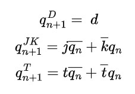
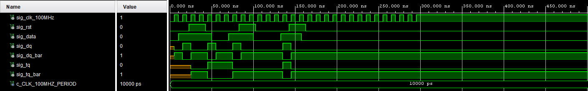

# Lab 5: Jan Gadas

## Pre-Lab preparation

1. Write characteristic equations and complete truth tables for D, JK, T flip-flops where `q(n)` represents main output value before the clock edge and `q(n+1)` represents output value after the clock edge.   



   **D-type FF**
   | **clk** | **d** | **q(n)** | **q(n+1)** | **Comments** |
   | :-: | :-: | :-: | :-: | :-- |
   |  | 0 | 0 | 0 | `q(n+1)` has the same level as `d` |
   |  | 0 | 1 | 0 | `q(n+1)` has the same level as `d` |
   |  | 1 | 0 | 1 | `q(n+1)` has the same level as `d` |
   |  | 1 | 1 | 1 | `q(n+1)` has the same level as `d` |

   **JK-type FF**
   | **clk** | **j** | **k** | **q(n)** | **q(n+1)** | **Comments** |
   | :-: | :-: | :-: | :-: | :-: | :-- |
   |  | 0 | 0 | 0 | 0 | No change |
   |  | 0 | 0 | 1 | 1 | No change |
   |  | 0 | 1 | 0 | 1 | Reset |
   |  | 0 | 1 | 0 | 1 | Reset |
   |  | 1 | 0 | 1 | 0 | Set |
   |  | 1 | 0 | 1 | 0 | Set |
   |  | 1 | 1 | 1 | 0 | Toogle |
   |  | 1 | 1 | 0 | 1 | Toogle |

   **T-type FF**
   | **clk** | **t** | **q(n)** | **q(n+1)** | **Comments** |
   | :-: | :-: | :-: | :-: | :-- |
   |  | 0 | 0 | 0 | No change |
   |  | 0 | 1 | 1 | No change |
   |  | 1 | 0 | 1 | Toogle |
   |  | 1 | 1 | 0 | Toogle |

<a name="part1"></a>

## D & T Flip-flops

1. Screenshot with simulated time waveforms. Try to simulate both D- and T-type flip-flops in a single testbench with a maximum duration of 350 ns, including reset. Always display all inputs and outputs (display the inputs at the top of the image, the outputs below them) at the appropriate time scale!

   

## JK Flip-flop

1. Listing of VHDL architecture for JK-type flip-flop. Always use syntax highlighting, meaningful comments, and follow VHDL guidelines:

```vhdl
architecture behavioral of jk_ff_rst is

    -- WRITE A SYNCHRONOUS PROCESS HERE

    -- Output ports are permanently connected to local signal
    q     <= sig_q;
    q_bar <= not sig_q;
end architecture behavioral;
```

## Shift register

1. Image of `top` level schematic of the 4-bit shift register. Use four D-type flip-flops and connect them properly. The image can be drawn on a computer or by hand. Always name all inputs, outputs, components and internal signals!

   


